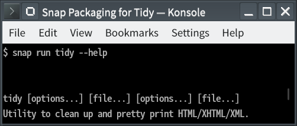

# Snap Packaging for Tidy

**This is the snap for Tidy**, *"HTML parser and pretty printer.  The grand daddy of HTML tools."*. It works on Ubuntu, Fedora, Debian, and other major Linux distributions.

## Installation
([Don't have snapd installed?](https://snapcraft.io/docs/core/install))

### In Terminal
    # Install Snap #
    sudo snap install tidy
    
    # Connect the Snap to Optional Interfaces #
    ## `removable-media`: For accessing files under /media and /run/media ##
    sudo snap connect tidy:removable-media

### The Graphical Way
Browse <https://snapcraft.io/tidy> and follow the instructions.

## Support
* Report issues regarding using this snap to the issue tracker:  
  <https://github.com/htacg/tidy-html5/issues>  

  be sure to mention you are using the snap package.

* You may also post on the Snapcraft Forum, under the `snap` topic category:  
  <https://forum.snapcraft.io/c/snap>
